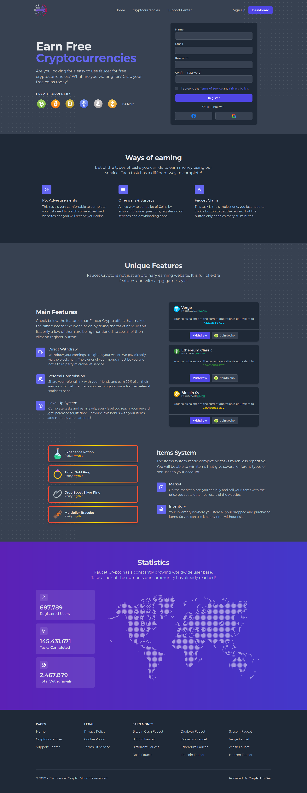
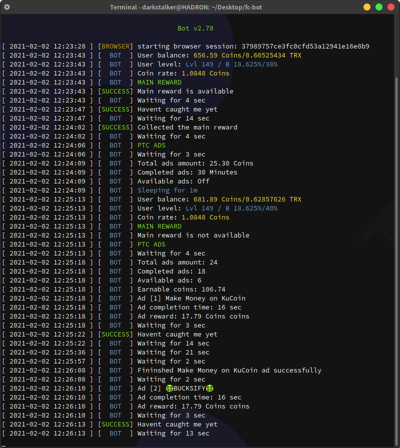

<!-- Logo and description part -->
<div align="center">

<p>
<br>
<br>
A bot for the high paying popular cryptocurrency faucet Faucet Crypto.
The bot is built using Python and Selenium, currently it is under active development and,
can do tasks like PTC ads, main rewards, and shortlinks except exe.io and fc.lc
</p>
</div>

<!-- Requirement Badges -->
<!-- Python badge -->
<p align="center">
<a href="https://www.python.org/">

</a>
<!-- Selenium badge -->
<a href="https://www.selenium.dev/">

</a>
<!-- Brave badge -->
<a href="https://brave.com/">

</a>
<!-- Chrome driver badge -->
<a href="https://chromedriver.chromium.org/downloads">

</a>
</p>

<!-- Status -->
<p align="center">
<br>


<!--  -->
</p>

<!-- Status -->
### Status

- Seems like Faucet Crypto has started using a bot detection system so you may need to obfuscate your driver to prevent it's detection. Please see below for the detailed instructions.

- The xpaths have been updated and new xpaths have been written to xpath.py you can replace the new file with the old file. Since i had to rush throught this if i missed something please let me know

- The layout of Faucet Crypto has changed and the bot won't work anymore you can wait for me to release the updated xpath file or you can add them manually to the xpath.py file.

- The issue of the bot was unable to find the claim button was fixed. The reason was due to an update in Faucet Crypto website. New xpaths have been updated you can copy the new xpaths to your old xpaths file.
(keep and eye on the bot status for further changes and updates that might occur.)

<!-- Disclaimer -->
### Disclaimer

<p align="center">

</p>

Please be note that this is the first major automation project for me. I am by no means responsible for any usage of this tool, Account bans or Nuclear winter. Use it on your own behalf. I'm also not responsible if your account get's banned.Therefore, if the Faucet Crypto devs catches you and get you banned,then don't point your fingers at me, for getting your account deleted? I will rolling on the floor laughing at you.

<!-- Description -->
## [Faucet Crypto]('https://faucetcrypto.com/')


<!-- Star reminder -->
#### If you found this repo useful please don't forget to give me a :star:

<!-- Browser preference -->
### Brave Browser

The browser of choice for this project is Brave browser due to its native
ad-blocking scripts which are pretty good and prevents random popup openings,
which can mess with the bots proper execution.

If you don't have Brave browser installed you can download it from here.

<p align="center">
<a href="https://brave.com/">

</a>
</p>

### Changes

###### v2.98
- Added much better error codes
- If the bot is run in headless mode it wont load images imporving load times significantly
- Instructions for driver obfuscations have been provided
- Much efficent compared to the previous versions
- Achievements collector has also been added but its only experimental and is disabled by default in the bot.py
file you can use this feature by uncommenting it
- Also added a feature where the bot screenshots the stupid popup ads that creep in from time to time.
- If the bot detects that the captcha is being triggered it will sleep for an hour before executing again.
- Fake User Agent has been added
- Option for completing fc.lc shortlinks added but disabled by default, cause it dosen't work always you can test it
out by uncommenting the sections below it in `FaucetCryptoBot/fcbot.py`.
- Bot automatically closes the modal and chat which was an issue in the previous version.
- Resolved the issue where the watch button for sh.faucetcrypot.com was covered by the chat button and
throwed an error.
- Removed the annoying 'NoneType' object has no attribute 'text' errors.
- Replaced pickle5 with pickle-mixin cause pickle5 was causing issues for windows users.
- Changes in requirements.txt file

###### v2.88
- Added logic to save cookies and use them for logging in. This prevents
using the default profile directory of your browser and dosen't mess it up.

- Added logic to close the welcome modal and chat which covered the dashboard
visibilty.

- Cookies are now saved to a cookie file if it is not present in the directory
the bot will automatically login with the user email and password provided on 
the config file and generate a new cookie file.

- Added proxy incase you want to generate some referrals. This method is not
recommended yet and try this at your own risk.

- Fixed the issue when the browser was running in normal mode the bot closing all
the open tabs.

### Installation

create a virtual environment with virtualenv

``` bash
virtualenv env
```

Activate the virtual environment

```bash
source env/bin/activate
```

Install all the necessary packages

```bash
pip install -r requirements.txt
```

### Important
#### The following is important to better hide your chromedriver
##### Replacing cdc_ string

You can use vim or perl to replace the cdc_ string in chromedriver.
Using vim or perl prevents you from having to recompile source code or use a hex-editor.

###### Make sure to make a copy of the original chromedriver before attempting to edit it.

Our goal is to alter the cdc_ string, which looks something like $cdc_lasutopfhvcZLmcfl.

##### Using Vim
```bash
vim /path/to/chromedriver
```
After running the line above, you'll probably see a bunch of gibberish. Do the following:

- Replace all instances of cdc_ with dog_ by typing `:%s/cdc_/dog_/g`.
dog_ is just an example. You can choose anything as long as it has the same amount of characters as the search string (e.g., cdc_), otherwise the chromedriver will fail.

- To save the changes and quit, type :wq! and press return.
If you need to quit without saving changes, type :q! and press return.

##### Using Pearl
- The line below replaces all cdc_ occurrences with dog_.

```bash
perl -pi -e 's/cdc_/dog_/g' /path/to/chromedriver
```
- Make sure that the replacement string (e.g., dog_) has the same number of characters as the search string (e.g., cdc_), otherwise the chromedriver will fail.

### Setup

Set the correct path for your brave browser in the config file config.py
``` bash
[Browser]
browser-mode =              #takes two parameters headless or leave it empty
driver-path =               #path to your chrome driver
browser-binary-location =   #path to your browser binary location

[User]
mail =                      #Your faucet crypto account mail
password =                  #your faucet crypto account password

[Misc]
debug =                     #takes two arguments True of False
proxy =                     #proxy address and port try not to use a proxy
                            #and leave this empty
```

### Run

Run the bot by

``` bash
python bot.py
```
<!-- screenshot -->



### Account setup

If it's your first time running the bot you need to login to Faucet crypto.
Run the bot in normal-mode(default) it will redirect to login page where you can login,
the bot will do the rest from there by collecting from all the ads. (Note) The bot can't
yet do the exe.io and fc.lc shortlinks so you would have to help it do that. If you've logged in successfully then you can run the bot in headless mode from then on you can set the bot
to headless mode by setting the "headless" flag in the config file.

```python
browser-mode = "headless"
```

### Contributions

Feel free to contribute to this project and help me improve this project


##### Thank You, 
###### Sourav
